<div align="center">
  

  
</div>

<br>

<div align="center">
  
</div>

<br>

<div align="center">

```text
╔═════════════════════════════════════════════════════════╗
       ⚡ SOURABH.SYS — DEVELOPER MODE ACTIVATED 
╚═════════════════════════════════════════════════════════╝

 ● DEVELOPER       Sourabh Sahu
 ● STATUS          TRAINING & BUILDING
 ● CURRENT ARC     FULL STACK + AI
 ● ENERGY LEVEL    ██████████ MAXIMUM 
 ● BUGS            STILL FIGHTING THEM 👾
 ● NEXT GOAL       LEVEL UP

       ⚡ BUILD • BREAK • LEARN • EVOLVE ⚡
```

</div>

<br>

## ⚡ DEVELOPER POWER LEVEL

<div align="center">
  
</div>

<br>
<br>

## 🌟 TRANSFORMATION SYSTEM

### 🟡 BASE FORM — FOUNDATION
I started my journey focused on mastering the core principles of web development. Laying a solid foundation in modern coding practices, I trained myself to write clean, maintainable, and highly efficient code.

### 🔥 SUPER DEVELOPER — FULL STACK
Evolving into a **MERN Stack** specialist, I architect scalable backend systems and design highly responsive user interfaces. I build end-to-end applications that are fast, secure, and user-centric.

### 🔵 GOD MODE — AI + MODERN SYSTEMS
Currently expanding my domain by integrating Artificial Intelligence into full-stack applications. I engineer AI-powered workspaces and intelligent chatbots that solve complex, real-world problems.

### ⚡ ULTRA INSTINCT — PROBLEM SOLVING
Thriving in high-pressure hackathons and building critical infrastructure. Whether it's ideation or deployment, I rely on my engineering instincts to build, optimize, and scale powerful platforms.

<br>

<div align="center">
  
</div>

<br>

## 🌌 PROJECT SAGAS

### 🎓 STUHUB — THE ACADEMIC SAGA
Building a smarter academic ecosystem from the ground up.
* **Features:** Attendance tracking, Assignments, Smart Notes, AI PYQ analysis, AI Chatbot, Digital Library, and Personalized Dashboards.
* **STATUS:**  <code>ACTIVE DEVELOPMENT</code>
* **POWER TYPE:** `AI + FULL STACK`

### 🩸 LIFELINK — THE HERO SAGA
Connecting people when every second matters through a smart blood donation platform.
* **Features:** Connecting donors & hospitals, Emergency blood requests, Chatbot support, and Location-based services.
* **STATUS:**  <code>MISSION ACTIVE</code>
* **POWER TYPE:** `REAL-TIME + LOCATION + FULL STACK`

<br>

<div align="center">
  
</div>

<br>

## 🔍 SCOUTER.SCAN("SOURABH")

```text
╭────────────── SCOUTER ──────────────╮
👤 DEVELOPER: Sourabh Sahu
⚡ REPOSITORIES: scanning...
🔥 STREAK: analyzing...
💻 TOP LANGUAGES: detected...
⭐ STARS: calculating...
╰─────────────────────────────────────╯
```

<div align="center">
  
  
</div>
<br>
<div align="center">
  
</div>

<br>

<div align="center">
  
</div>

<br>

## 🐉 DRAGON.ENERGY.MATRIX

*Note: This energy trail is generated dynamically via GitHub Actions and hosted securely in this repository.*

<p align="center">
  <picture>
    <source media="(prefers-color-scheme: dark)" srcset="https://raw.githubusercontent.com/sourabh-sahu-08/sourabh-sahu-08/output/github-contribution-grid-snake-dark.svg">
    <source media="(prefers-color-scheme: light)" srcset="https://raw.githubusercontent.com/sourabh-sahu-08/sourabh-sahu-08/output/github-contribution-grid-snake.svg">
    
  </picture>
</p>

<br>

<div align="center">
  
</div>

<br>

## 🏆 TOURNAMENT RESULTS

```text
╔════════════ TOURNAMENT RESULTS ════════════╗

  🥉 IDEATHON 2026
     POSITION: 3RD PLACE
     RANKING: Recognized for rapid prototyping

  🏅 NHIDE HACKATHON
     STATUS: TOP 20 FINALIST
     RANKING: Engineered impactful solutions

╚════════════════════════════════════════════╝
```

<br>

<div align="center">
  
</div>

<br>

## ⚔️ DEVELOPER TECHNIQUES

### ⚡ FRONTEND TECHNIQUES
    

<br>

### 🔥 BACKEND TECHNIQUES
  

<br>

### 🟢 DATABASE TECHNIQUES


<br>

### 🧠 AI TECHNIQUES
 

<br>

### 🛠️ TRAINING EQUIPMENT
   

<br>

<div align="center">
  
</div>

<br>

## 🧘 CURRENT TRAINING ARC

```text
CURRENT TRAINING:

⚡ Advanced Full Stack Development
🤖 AI Integration
🏗️ Scalable System Architecture
🎨 Advanced UI/UX
```

<br>

## 🧠 ULTRA INSTINCT

> *"Don't just write code.<br>Train until solving problems becomes instinct."*

<br>

<div align="center">
  
</div>

<br>

## 🌌 NEXT EPISODE...

```text
━━━━━━━━━━━━━━━━━━━━━━━━━━━━━━━━━━

       NEXT EPISODE...

       "THE NEXT BIG BUILD"

        🚀 COMING SOON...

━━━━━━━━━━━━━━━━━━━━━━━━━━━━━━━━━━
```

<br>

### 🤝 JOIN THE JOURNEY

<div align="center">
  <a href="https://linkedin.com/in/sourabh-sahu-9a4257315/"></a>
  <a href="mailto:sourabh08923@gmail.com"></a>
  <a href="https://x.com/Sourabh634031"></a>
  <a href="https://instagram.com/_sourabhh18"></a>
</div>
