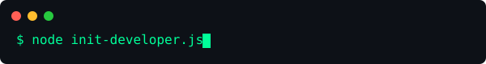

<div align="center">
  
  
  
  <br><br>
  
  
  
  <br><br>
  
  <p align="center">
    <a href="https://linkedin.com/in/sourabh-sahu-9a4257315/"></a>
    <a href="https://x.com/Sourabh634031"></a>
    <a href="https://instagram.com/_sourabhh18"></a>
    <a href="mailto:sourabh08923@gmail.com"></a>
  </p>
</div>

<br>

<div align="center">
  
</div>

<br>

## ⚡ DEVELOPER COMMAND CENTER

```text
╭───────────────────────────────────────────────────╮
│  ~/sourabh/system_status.sh                       │
├───────────────────────────────────────────────────┤
│                                                   │
│  > developer.name       Sourabh Sahu              │
│  > developer.role       Full Stack Developer      │
│  > current_focus        AI + Web + Scaling        │
│  > currently_building   StuHub, LifeLink          │
│  > system.location      India                     │
│  > bugs_found           404 Not Found             │
│  > coffee_level         OPTIONAL ☕               │
│  > system.status        ██████████ ONLINE         │
│                                                   │
╰───────────────────────────────────────────────────╯
```

<br>

<div align="center">
  
</div>

<br>

## 🛰️ TELEMETRY.METRICS("GitHub Analytics")

<div align="center">
  
  
</div>
<br>
<div align="center">
  
</div>

<br>

<div align="center">
  
</div>

<br>

## 🐍 DATA.STREAM("Contribution Matrix")

*Note: This animation is generated reliably via GitHub Actions and hosted locally on this repository.*

<p align="center">
  <picture>
    <source media="(prefers-color-scheme: dark)" srcset="https://raw.githubusercontent.com/sourabh-sahu-08/sourabh-sahu-08/output/github-contribution-grid-snake-dark.svg">
    <source media="(prefers-color-scheme: light)" srcset="https://raw.githubusercontent.com/sourabh-sahu-08/sourabh-sahu-08/output/github-contribution-grid-snake.svg">
    
  </picture>
</p>

<br>

<div align="center">
  
</div>

<br>

## 🚀 EXECUTE.PROJECTS("Currently Building")

<table width="100%">
  <tr>
    <td width="50%" align="center">
      <br>
      <h3>🎓 StuHub</h3>
      <p><em>AI-powered academic workspace</em></p>
      <p> <code>STATUS: ACTIVE DEVELOPMENT</code></p>
    </td>
    <td width="50%" align="center">
      <br>
      <h3>🩸 LifeLink</h3>
      <p><em>Smart blood donation platform</em></p>
      <p> <code>STATUS: ACTIVE DEVELOPMENT</code></p>
    </td>
  </tr>
  <tr>
    <td valign="top">
      <ul>
        <li>✅ Attendance tracking & Assignments</li>
        <li>✅ Smart Notes & AI PYQ analysis</li>
        <li>✅ Interactive Chatbot & Digital Library</li>
        <li>✅ Personalized Dashboards</li>
      </ul>
    </td>
    <td valign="top">
      <ul>
        <li>✅ Connects donors & hospitals</li>
        <li>✅ Emergency request routing</li>
        <li>✅ Location-based services</li>
        <li>✅ Chatbot support system</li>
      </ul>
    </td>
  </tr>
</table>

<br>

<div align="center">
  
</div>

<br>

## 🛠️ SYSTEM.CONFIG("Live Tech Stack")

### 💻 `FRONTEND.EXE`
     

<br>

### ⚙️ `BACKEND.API`
     

<br>

### 🗄️ `DATABASE.DB`
   

<br>

### 🛠️ `TOOLS.SH`
   

<br>

<div align="center">
  
</div>

<br>

## 🏆 PROFILE.AWARDS("Achievements")

| 🏅 Award / Achievement | 📝 Description |
| :--- | :--- |
| 🥉 **3rd Place** | IDEATHON 2026 — Recognized for innovative problem-solving and rapid prototyping. |
| 🏆 **Top 20 Finalist** | NHIDE Hackathon — Competed among top developers to engineer impactful solutions. |
| 💼 **Web Dev Internship** | Completed a professional internship contributing to production-ready features, UI optimizations, and bug fixes. |

<br>

<div align="center">
  
</div>

<br>

## 🤝 CONNECTION.ESTABLISH("Let's Connect")

<div align="center">
  <p><b>Have an idea, project, or opportunity? Let's build something awesome together.</b></p>
  <br>
  <a href="https://linkedin.com/in/sourabh-sahu-9a4257315/"></a>
  <a href="mailto:sourabh08923@gmail.com"></a>
  <a href="https://x.com/Sourabh634031"></a>
  <a href="https://instagram.com/_sourabhh18"></a>
</div>

<br>

<div align="center">
  <i>"Build products that solve real problems, write clean code, and never stop learning."</i>
</div>
